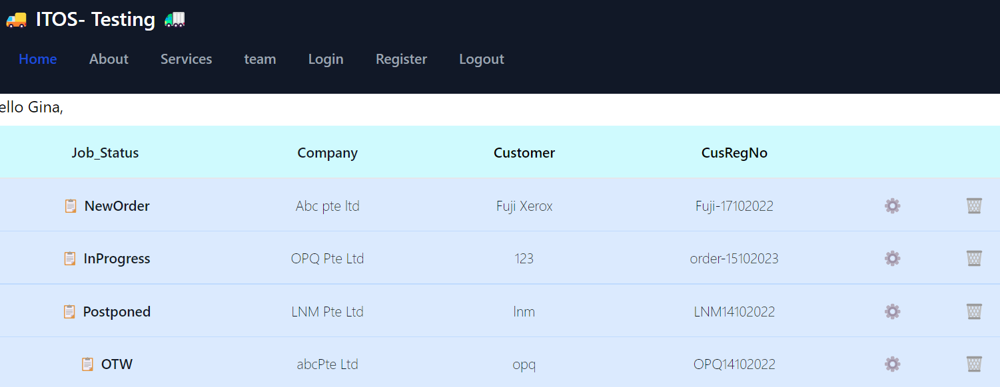
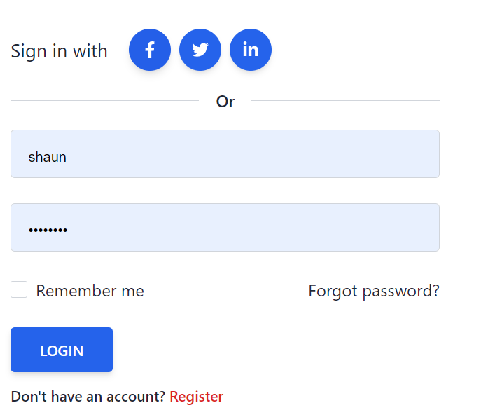
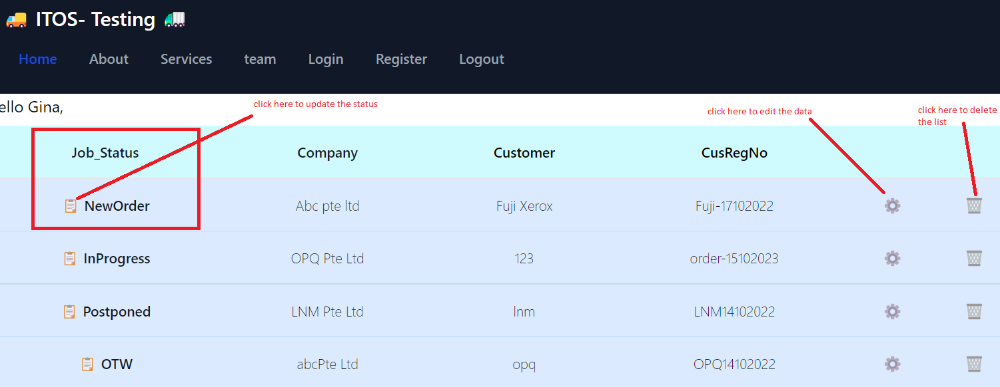
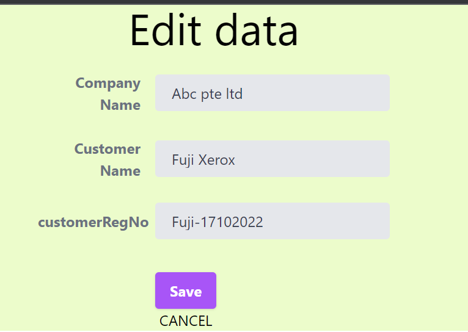
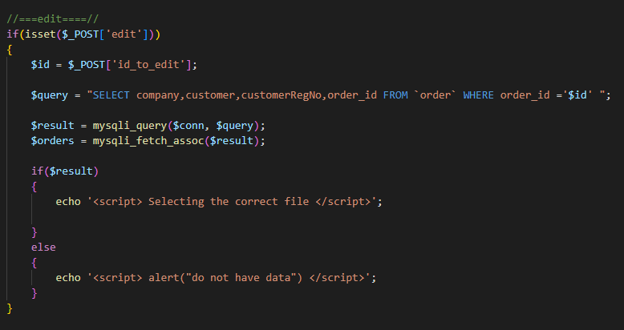

# Project Title : Tracking system 	:round_pushpin:

## Features
 * signup
 * log in 
 * log out
 * tracking number and cutomers
 * add new order/customer/company detail :wrench:
 * edit data :gear:
 * delete data :bangbang:
 

 ## A step-by-step guide 

 1. user must log in to account in order to view the data :mag:

 

 
 2. user able to updat status by clicking the left side icon
 3. right side small icon can update and delete 

  

 

 ### the code review 

 #### view

 
  

## Technology 

* PHP framework
* Tailwind CSS

